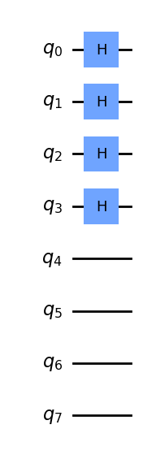
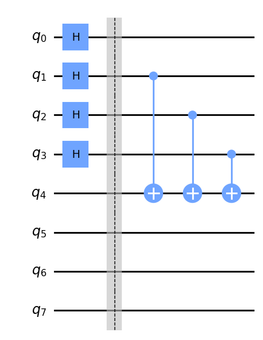
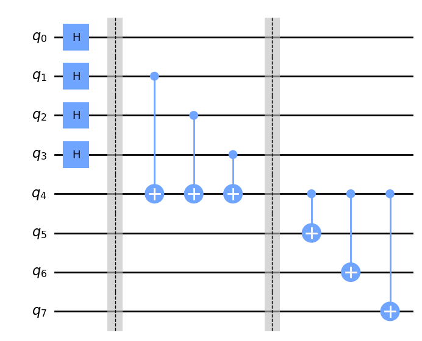
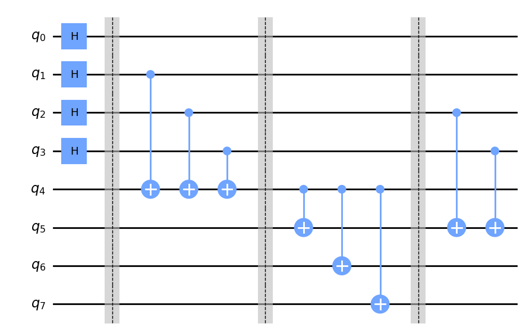
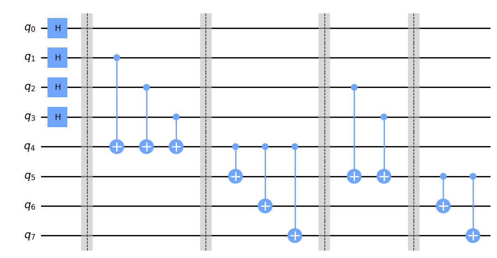
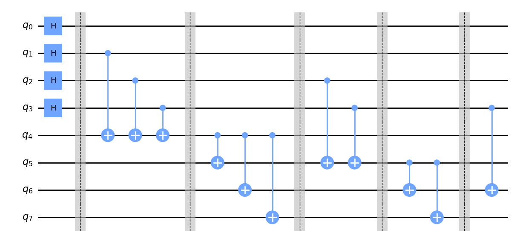
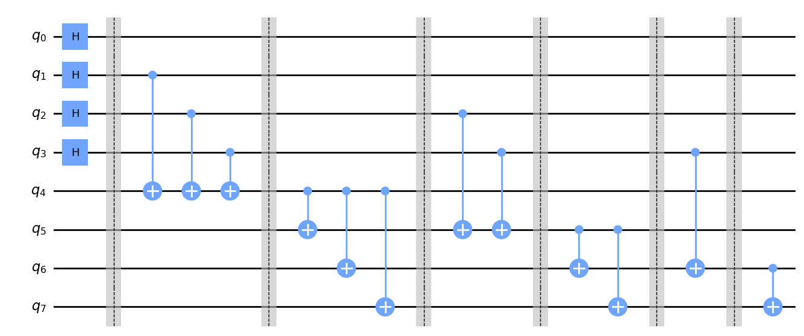
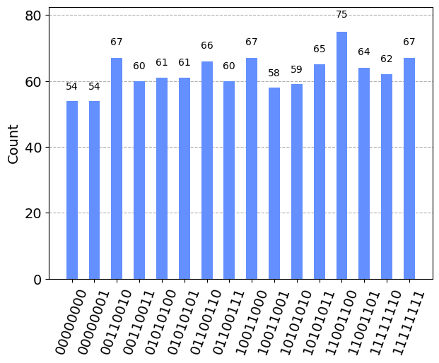

```python
# import
```


```python
import numpy as np
from qiskit import *
from qiskit import Aer
from qiskit.visualization import plot_histogram, plot_state_city
from qiskit_ibm_runtime import QiskitRuntimeService, Estimator, Options
```


```python
# création d'un circuit de 8 qbits
```


```python
circ = QuantumCircuit(8)
```


```python
# on place une porte hadamard sur les 4 premier qubits
```


```python
circ.h(0)
circ.h(1)
circ.h(2)
circ.h(3)
```


    <qiskit.circuit.instructionset.InstructionSet at 0x1f7fc626950>


```python
circ.draw('mpl',style='clifford')
```


    

    


```python
circ.barrier()
```


    <qiskit.circuit.instructionset.InstructionSet at 0x1f7fd59df90>


```python
# observation si les valeurs des qubits de 1 à 4 on une valeur "1" pair ou umpair et la valeur de cette observation 
#est stoké dans la valeur du qbits 4
```


```python
circ.cx(1,4)
circ.cx(2,4)
circ.cx(3,4)

circ.draw('mpl',style='clifford')
```


    

    


```python
circ.barrier()
```


    <qiskit.circuit.instructionset.InstructionSet at 0x1f7fd695270>


```python
# prise en compte de la valeur obsersé dans les qbits représentant les décision (5-7)
```


```python
circ.cx(4,5)
circ.cx(4,6)
circ.cx(4,7)

circ.draw('mpl',style='clifford')
```


    

    


```python
circ.barrier()
```


    <qiskit.circuit.instructionset.InstructionSet at 0x1f7fe9a6aa0>


```python
#observation des valeurs "1" des qubits se trouvant devant le qubits 1 
```


```python
circ.cx(2,5)
circ.cx(3,5)

circ.draw('mpl',style='clifford')
```


    

    


```python
circ.barrier()
```


    <qiskit.circuit.instructionset.InstructionSet at 0x1f7fe9a6560>


```python
#prise en compte de cette observation dans les deux denier qbits de décisions (6-7)
```


```python
circ.cx(5,6)
circ.cx(5,7)

circ.draw('mpl',style='clifford')
```


    

    


```python
circ.barrier()
```


    <qiskit.circuit.instructionset.InstructionSet at 0x1f7fe9a5210>


```python
#obvervation du qbits en face et stokage dans le qbits de décision
```


```python
circ.cx(3,6)

circ.draw('mpl',style='clifford')
```


    

    


```python
circ.barrier()
```


    <qiskit.circuit.instructionset.InstructionSet at 0x1f7fe9a5f00>


```python
# prise de décision de la dernière valeur du qbits
```


```python
circ.cx(6,7)

circ.draw('mpl',style='clifford')
```


    

    


```python
circ.barrier()
```


    <qiskit.circuit.instructionset.InstructionSet at 0x1f7fe9a7a60>


```python
#mesure de tous les qbits
```


```python
meas = QuantumCircuit(8)
meas.measure_all()
```


```python
backend = BasicAer.get_backend('qasm_simulator') # the device to run on
circ = circ.compose(meas)
result = backend.run(transpile(circ, backend), shots=1000).result()
counts  = result.get_counts(circ)
plot_histogram(counts)
```


    

    


